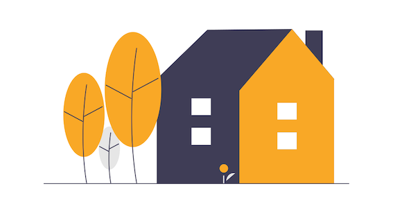
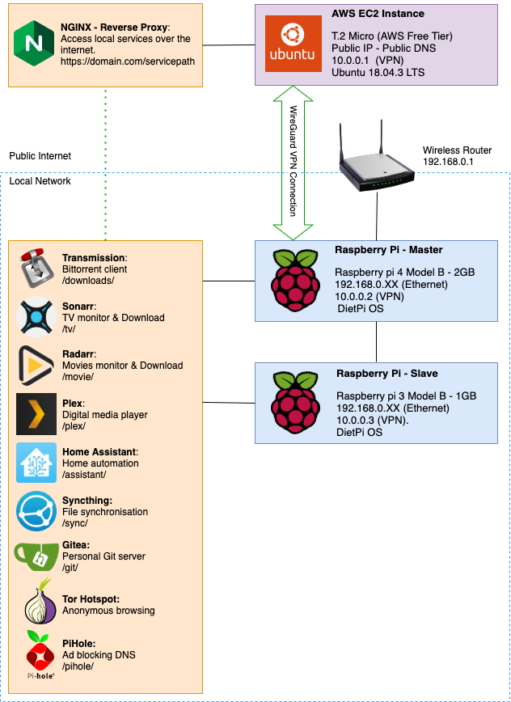

# My Home Lab - Architecture, Security and Usecases 

**Usecase:**
-
1. BitTorrent client to download and seed torrent files. Tool used: ***Transmission***.
2. Automatically monitor and download TV shows and movies. Tools used - ***Sonarr, Radarr & Jackett***.
3. Home Assistant and Automation. Tool used: ***Home Assistant***.
4. Personal Git Server. Tool used: ***Gitea***.
5. Local Ad blocking DNS Server. Tool used: ***PiHole***.
6. Media Management and Streaming (Local and Online) for downloaded media content. Tool used: **Plex Media Server**.
7. Tor enabled WiFi HotSpot.
8. Continuous File Synchronization. Tool used: **Syncthing** 
9. Custom Self hosted scripts and services for my side projects.
10. **Todo**: 
    - [ ] Monitoring and Analytics (**ELK** or **Grafana**).
    - [ ] Personal Dashboards for Servers Frontend, Habit tracker etc. - **Habitica, Organizr, Simple-dash**.
    - [ ] Password Manager - **BitWarden**.
    - [ ] **Code Server** - Visual Studio Code in the browser.
    - [ ] **LazyLibrarian** - Automatically monitor and download ebooks, audiobooks and magazines.
    - [ ] **n8n** - Node based Workflow Automation Tool.
    - [ ] **Kubernetes** cluster and HA.
    - [ ] **RAID** configuration and Auto Backups.
 
**Architecture:** 
-

**Security:**
-
1.
**Useful Links:**
-
1.